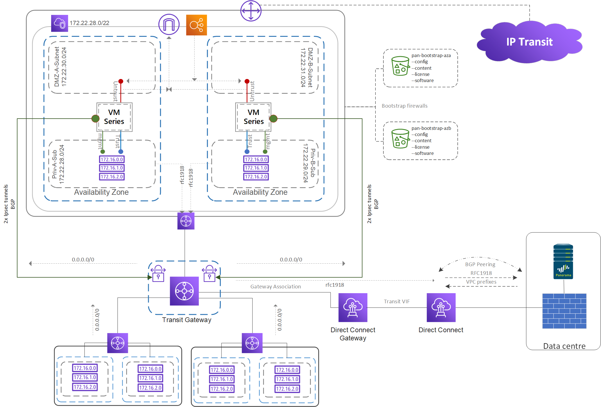

---
# Transit gateway deployment
---

## Description
This repository contains terraform modules to deploy a transit gateway topology and centralised NAT provided by two Palo Alto Networks firewalls, optionally a private Direct Connect will be deployed for connectivity to the physical data centre and/or an application load balancer for ingress http/https services. The purpose is to deploy the infrastructure with as little manual intervention or processes as practical, the AWS network will be managed using Terraform while the Palo Alto Networks firewalls managed with Panorama. 

The topology is intended to run with a public Direct Connect and Panorama in the physical data centre to bootstrap and manage the configuration. Some variables exist to remove components including:
* Direct Connect
* Ingress application load balancer

If you want to remove the Direct Connect you will need to do some tweaking on your own. For example, removing the Direct Connect to the on-prem data centre where Panorama is running will prevent the firewall from contacting Panorama for its bootstrap config. In that case you will need to remove the relevant lines from init-cfg.txt in the bootstrap S3 bucket and provide a bootstrap.xml file.

### Topology
A VPC with four subnets are created

**Private-A-Subnet & Private-B-Subnet:** 
Private servers, connectivity to on-prem and other spoke accounts via the transit gateway

**DMZ-A-Subnet & DMZ-B-Subnet:** 
Public facing servers, public addressing, internet access, no direct access back to on-prem over the private Direct Connect

Transit gateway will route all traffic from the Private-A-Subnet & Private-B-Subnets of this new VPC and all spoke VPC's between each other, to on-prem via the Direct Connect or to the internet through VPN tunnels created between the transit gateway and two Palo Alto Networks firewalls (version 8.1.x) in the DMZ-A-Subnet & DMZ-B-Subnet.

Panorama configuration or the Direct Connect provisioning (physical ports with AWS or using a provider such as Megaport are out of scope of this document).



## Requires

* Only Terraform v0.12
* Tested on v0.12.24

## Contains

Consists of three modules, Network, Tgw and PanFw

**Network:** 
Creates the network components within AWS required by many projects.

* VPC
* Subnets, Route tables, Associations
* Nat gateway, Internet gateway, EIPs.

**Tgw:** 
Running this module will create components necessary for deploying transit gateway, connecting to a centralised nat subnets (created by the network module) and attaching Direct Connect to the transit gateway for connectivity to on-premises.

* Transit gateway
* Direct connect gateway
* BGP peering to on-premises
* RAM resources
* Transit gateway route table entries.

**PanFw:** 
Deploys two Palo Alto firewalls (v8.1.x) into the centralised NAT VPC to be used for internet connectivity and NAT.

* Palo Alto firewalls
* Nics and EIPs
* IAM roles
* Bootstrap
* Route table modifications
* Security groups
* Firewall bootstraping

# Instructions

1. **Palo Alto Networks bootstrap requirements:** 

    Setup the master bootstrap S3 buckets as documented by Palo Alto Networks and configure the init-cfg.txt file with the required information including the Panorama templates and device groups you want to push. (See section "What the documentation doesn't tell you" for additional notes.)

    Ensure you generate the VM auth key on Panorama

    bootstrap.xml is not necessary if you are pushing from Panorama.

    Within the "license" folder create a file called "authcodes" you add the authcode here with no other text.

2. **Configure Panorama**

    Configure the device group and template stack using Panorama with all of the base config you will need to apply to the firewalls during bootstrap. This should include anything that will give your VPC's access to the internet through the firewalls including:

* Device group
  - Policy to allow traffic to the internet
  - NAT
    
* Template stack
  - Virtual routers
  - Zones
  - Interface configuration
  - Static routes
    - You will need to route private traffic (from Private-A-Subnet and Private-B-Subnet) out of the trust interface (Eth1/2) to the transit gateway and default traffic out the Public interface (Eth1/1).
        Example:
        ```
        set template <PanoramaTemplateName> config  network virtual-router <virtual-router> routing-table ip static-route rfc1918_172 interface ethernet1/1
        set template <PanoramaTemplateName> config  network virtual-router <virtual-router> routing-table ip static-route rfc1918_172 destination 172.16.0.0/12
        set template <PanoramaTemplateName> config  network virtual-router <virtual-router> routing-table ip static-route rfc1918_172 route-table unicast 
        set template <PanoramaTemplateName> config  network virtual-router <virtual-router> routing-table ip static-route Default_AwsRouter nexthop ip-address 172.22.30.1
        set template <PanoramaTemplateName> config  network virtual-router <virtual-router> routing-table ip static-route Default_AwsRouter interface ethernet1/1
        set template <PanoramaTemplateName> config  network virtual-router <virtual-router> routing-table ip static-route Default_AwsRouter destination 0.0.0.0/0
        set template <PanoramaTemplateName> config  network virtual-router <virtual-router> routing-table ip static-route Default_AwsRouter route-table unicast
        ```
        
* Other
  - Configure the BGP peering between the Direct Connect Gateway and your data centre firewall so you can route into AWS through the private Direct Connect.

3. **Variables:**

    Edit the variable files within each module using your own values, descriptions for each variable are contained within the variable file.
    ```
    * /Network/variables.tf
    * /Tgw/variables.tf
    * /PanFw/variables.tf
    ```

    >**Note:** For the first deployment ensure that `priv_a_subnet_defaultRoute` and `priv_b_subnet_defaultRoute` are set to `true` so a NAT gateway is created and the firewalls management interface can access the internet through it for licensing. The bootstrap process will fail without this.
    
    ```
    variable "priv_a_subnet_defaultRoute" {
        description = "true = nat gateway, modifies Private subnet route table"
        type        = bool
        default     = false
    }
    variable "priv_b_subnet_defaultRoute" {
        description = "true = nat gateway, modifies Private subnet route table"
        type        = bool
        default     = false
    }
    ```

4. **Deploy** 
    
    Authenticate to your AWS account

    Run "terraform plan"
    
    Run "terraform apply"
       
    Wait for the deployment and ensure the firewalls have licensed and completed upgrading/bootstrapping. Monitor the VM screenshot for progress.

5. **Configure IPsec tunnels**

    Configure the IPSec VPN tunnels between the AWS firewalls and the transit gateway, the AWS side will be configured by the script, you will need to configure the firewalls.
    For the first deployment you will need to configure all of the policies, any subsequent deployment that may need to rebuild the tunnels will require you to edit the Ike gateway peer address on the firewalls.

    >**Note:** The IPsec and BGP configuration parameters will be output in the console after running #terraform apply. This will list the peering, BGP and tunnel information required to configure the AWS Palo Alto Networks firewalls.

    >**Note:** I have observed the tunnels inner address configured in reverse, for example, tunnel 1 inside CIDR configured as tunnel 2 in AWS so if IPsec states it's up but the status is down this may be the cause. I haven't investigated whether this is a provider problem.

    If you need assistance configuring the IPsec VPN on the firewalls, I suggest looking at Palo Alto Networks document: aws-transit-gateway-deployment-guide

    Configure BGP between the AWS firewalls and the transit gateway, advertise a default route from the AWS firewalls to transit gateway. DO NOT advertise connected subnets otherwise you will advertise the private subnet CIDR ranges through the VPN tunnels and lose management access to the firewalls.

6. **Modify default route** 
    Set the variables for "priv_a_subnet_defaultRoute" & "priv_b_subnet_defaultRoute" to "false"
    This will delete the NAT gateway and modify the route tables to direct default traffic from the private subnets, including the firewalls management interface to the transit gateway.

    Run "terraform plan"
    Run "terraform apply"

# Procedures
## Redeploy a firewall in one AZ
You can redeploy the firewall in a single AZ by marking one of the existing firewalls as tainted.
- *Optional:* You will decrease the failover time by manipulating the BGP attributes, for example increase the "as prepend" value of the default route advertised from the preferred prefix so that the route to the other firewall is more preferred.
- Deactivate the license from the Palo Alto Networks firewall.  
  - Login to the firewall GUI --> Licenses --> License Management --> Deactivate VM --> Complete manually --> Export license token  
  - Login to the Palo Alto support page --> Assets --> VM-Series Auth Codes --> Deactivate License(s) --> Paste the token  
  - The "Quantity of VM Provisioned" should decrement.  
- `terraform taint module.PanFw.aws_instance.FwInstance_aza`  
- Set the variable `priv_a_subnet_defaultRoute = "true"`  
- `terraform plan`  
- `terraform apply`  

# What the documentation doesn't tell you.

There was a lot of testing and workaround I had to determine on my own to help understand the bootstrap flow and licensing, I've summarised a small number below.

# S3 buckets
Create two S3 buckets, one for each AWS availability zone and direct each firewall to a different bucket.

The IPsec VPN tunnel information required to create connectivity between the firewalls and transit gateway will vary so you will need to apply a different template (specified in init-cfg.txt) from Panorama to each firewall during bootstrapping. 

You are able to specify an init-cfg.txt file and scope it for a particular firewall by prepending the UUID or serial however these details aren't known before creating the firewall in AWS so doesn't assist in an automated deployment.

example buckets:

vmseries-aws-bucket-aza
- config
- content
- license
- software

vmseries-aws-bucket-azb
- config
- content
- license
- software

# Licensing
I observed that any issue preventing licensing from registering interrupts some of the bootstrap process. Firewalls will be upgraded and init-cfg.txt will be applied however bootstrap.xml or any push from Panorama never complete. 

You get one chance to bootstrap so if it fails to complete successfully will need to manually resolve the issue, gain access to the firewall's management interface, deactivate the licenses and perform a redeploy of the firewalls.

Palo Alto Networks often suggests assigning the management interface a pubic IP address so that management and licensing will be available over the internet however this would mean that the interface is created in the DMZ which doesn't typically have access to Panorama in the physical data centre. It also limits access to any services which may also be running on-prem such as DNS, user-id agents, RADIUS etc.

I create the firewalls management interface in a private subnet with access to the on-prem data centre and panorama however if you intend to use the firewalls to provide internet firewalling and NAT for your AWS infrastructure the firewalls are unable to complete bootstrapping because the management interface requires the firewall to provide internet access for licensing then bootstrap.
This creates a chicken and the egg scenario, the firewall needs to bootstrap to get it's config and provide internet access from the private subnet (and its mgmt interface) however it can't configure itself until it gets internet access to license.

The way I worked around this was to deploy a NAT gateway on initial deployment for internet traffic, once the firewalls have been deployed, bootstrap complete and the firewalls have their configuration I modify a boolean variable and rerun terraform. The NAT gateway is then destroyed, and route tables adjusted to route internet traffic out of the firewalls.

it's a reluctant workaround.

# High-Availability
High availability for any appliance in AWS (IMO) has always been sub-par and this is no different, BGP seems to be the best solution for enabling control of routing and failover between availability zones and the only way to enable BGP is to create an IPsec VPN between the transit gateway and firewalls.
This comes with additional cost and complexity but appears to be unavoidable.


